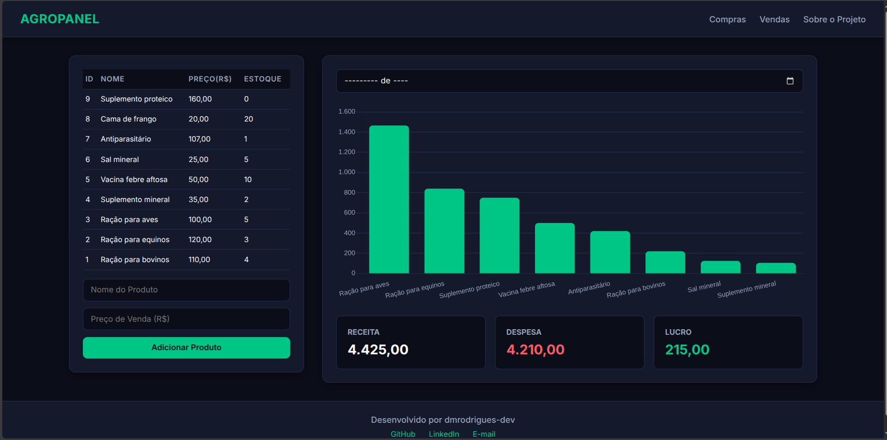
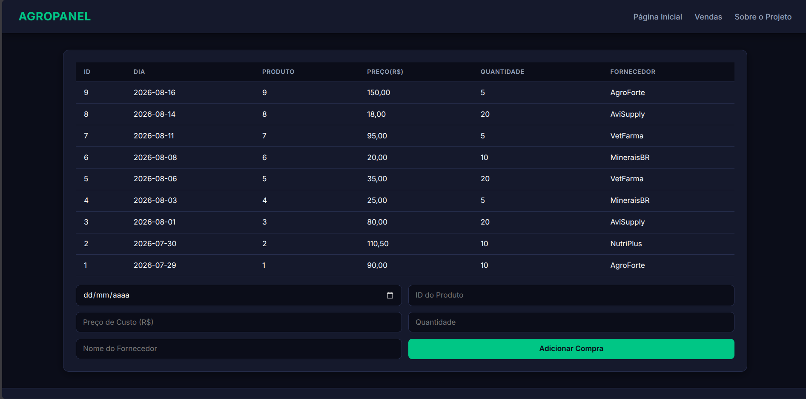
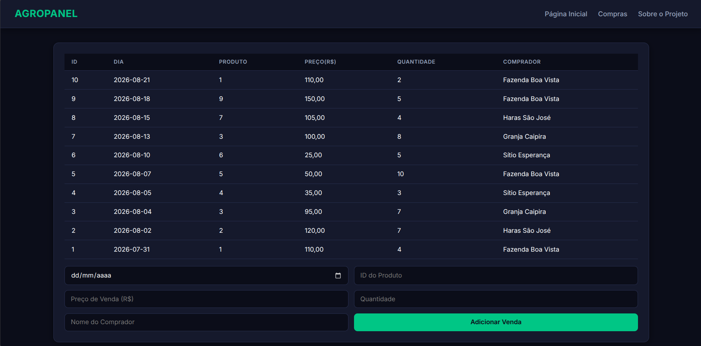

# Agropanel

Sistema web de demonstração para a gestão de um pequeno comércio agropecuário. O projeto permite cadastrar produtos, registrar compras e vendas, acompanhar o estoque e visualizar indicadores financeiros por período.

> Projeto desenvolvido para portfólio. Os dados exibidos são demonstrativos.

## Demonstração

- API em produção: [agropanel.onrender.com](https://agropanel.onrender.com)
- Frontend: [agropanel-six.vercel.app](https://agropanel-six.vercel.app/index.html).

Como a API utiliza o plano gratuito do Render, ela pode levar alguns segundos para iniciar após um período sem acessos. A interface exibe um aviso de carregamento enquanto isso acontece.

## Telas

### Dashboard e produtos



### Compras



### Vendas



## Funcionalidades

- Cadastro, consulta, edição e exclusão de produtos.
- Registro de compras e vendas.
- Atualização automática de estoque a cada movimentação.
- Bloqueio de vendas que excedem o estoque disponível.
- Dashboard com receita, despesa, resultado do período e gráfico de receita por produto.
- Filtro mensal para os indicadores do dashboard.
- Interface responsiva para telas menores.
- Modal de carregamento e estado de erro para a inicialização da API.
- Reset protegido para restaurar dados de demonstração.

## Tecnologias

| Camada         | Tecnologias                          |
| -------------- | ------------------------------------ |
| Frontend       | HTML, CSS, JavaScript e Chart.js     |
| Backend        | Python, Flask, Flask-CORS e Gunicorn |
| Banco de dados | PostgreSQL e SQLAlchemy Core         |
| Infraestrutura | Vercel, Render e Supabase            |

## Arquitetura

```text
Navegador
    │
    ▼
Frontend estático (Vercel)
    │  HTTP / JSON
    ▼
API REST em Flask (Render)
    │  SQLAlchemy Core
    ▼
PostgreSQL (Supabase)
```

O frontend consome a API REST e renderiza os dados em tabelas, cards e gráficos. A API concentra a validação das requisições e o PostgreSQL mantém as relações e regras de integridade dos dados.

## Modelo de dados e estoque

O sistema possui três entidades principais:

- **Produtos:** nome, preço padrão de venda e estoque atual.
- **Compras:** entradas de produtos, com data, fornecedor, preço e quantidade.
- **Vendas:** saídas de produtos, com data, comprador, preço e quantidade.

O estoque é controlado por triggers no PostgreSQL:

- uma compra aumenta o estoque;
- uma venda reduz o estoque;
- editar ou excluir uma movimentação recalcula o saldo;
- uma trigger `BEFORE INSERT OR UPDATE` impede vendas acima do estoque disponível.

As constraints do banco também impedem saldo e valores negativos. Valores iguais a zero são permitidos para registrar situações excepcionais, como bonificações ou ajustes.

## Endpoints principais

| Método             | Endpoint                            | Descrição                                          |
| ------------------ | ----------------------------------- | -------------------------------------------------- |
| GET / POST         | `/api/produtos`                     | Lista ou cria produtos                             |
| GET / PUT / DELETE | `/api/produtos/:id`                 | Consulta, atualiza ou remove um produto            |
| GET / POST         | `/api/compras`                      | Lista ou cria compras                              |
| GET / PUT / DELETE | `/api/compras/:id`                  | Consulta, atualiza ou remove uma compra            |
| GET / POST         | `/api/vendas`                       | Lista ou cria vendas                               |
| GET / PUT / DELETE | `/api/vendas/:id`                   | Consulta, atualiza ou remove uma venda             |
| GET                | `/api/estatisticas?mes=MM&ano=AAAA` | Retorna indicadores do período                     |
| POST               | `/api/seed/reset`                   | Restaura os dados demonstrativos com token secreto |

As rotas de compras e vendas aceitam opcionalmente o parâmetro `dias` para filtrar movimentações recentes, por exemplo: `/api/vendas?dias=30`.

## Como executar localmente

### Pré-requisitos

- Python 3;
- PostgreSQL;
- Git.

### 1. Clone o repositório

```bash
git clone https://github.com/dmrodrigues-dev/agropanel.git
cd agropanel
```

### 2. Crie e ative um ambiente virtual

```bash
python -m venv .venv
```

Linux/macOS:

```bash
source .venv/bin/activate
```

Windows PowerShell:

```powershell
.venv\Scripts\Activate.ps1
```

### 3. Instale as dependências

```bash
pip install -r api/requirements.txt
```

### 4. Configure as variáveis de ambiente

Crie um arquivo `.env` na raiz do projeto. Não versione esse arquivo.

```env
DB_USER=seu_usuario
DB_PASSWORD=sua_senha
DB_HOST=localhost
DB_PORT=5432
DB_DATABASE=agropanel
SEED_SECRET_TOKEN=um_token_secreto
```

### 5. Crie o banco e aplique o schema

Crie um banco PostgreSQL chamado `agropanel` e execute:

```bash
psql -U seu_usuario -d agropanel -f schema.sql
psql -U seu_usuario -d agropanel -f reset_table.sql
```

O segundo comando é opcional, mas adiciona os dados usados na demonstração.

### 6. Inicie a API

```bash
cd api
python app.py
```

A API ficará disponível em `http://localhost:5000`.

### 7. Inicie o frontend

Abra a pasta `frontend` com uma extensão de servidor estático, como Live Server no VS Code. Em ambiente local, `frontend/javascript/config.js` detecta `localhost` e utiliza a API em `http://localhost:5000`.

## Estrutura do projeto

```text
agropanel/
├── api/
│   ├── app.py                 # aplicação Flask e handlers de erro
│   ├── database.py            # engine SQLAlchemy e conexão PostgreSQL
│   ├── utils.py               # validações e conversões reutilizáveis
│   └── blueprints/            # rotas de produtos, compras, vendas e estatísticas
├── frontend/
│   ├── index.html             # dashboard e produtos
│   ├── compras.html           # gestão de compras
│   ├── vendas.html            # gestão de vendas
│   ├── sobre.html             # visão técnica do projeto
│   ├── css/style.css          # estilo compartilhado e responsividade
│   └── javascript/            # configuração e lógica das páginas
├── schema.sql                 # tabelas, constraints, funções e triggers
└── reset_table.sql            # seed de dados demonstrativos
```

## Autor

Desenvolvido por [Davi Matos Rodrigues](https://github.com/dmrodrigues-dev).

- [GitHub](https://github.com/dmrodrigues-dev)
- [LinkedIn](https://www.linkedin.com/in/davi-matos-rodrigues-057430268/)
- [E-mail](mailto:davimatosrodrigues02@gmail.com)
